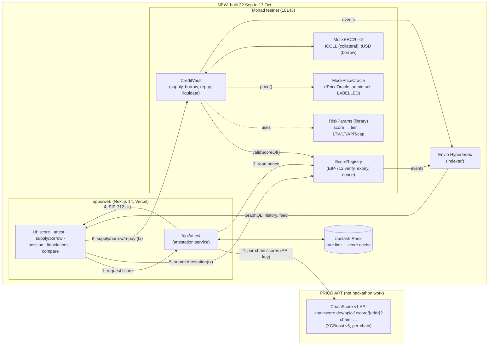

# PLAN: Tenor

> **Status (2026-09-22):** Phase 0 was approved, and the project is named
> Tenor (Q8). Phase 1 changed the contract design: one rate for every
> borrower, one global borrow index, LTV 60–80%, a liquidation threshold 5
> points above max LTV, no close factor, and liquidations recorded
> on-chain. **Section 2 below is superseded by CONTRACTS.md and the
> Phase 1 resolutions in OBJECTIONS.md.** This file is kept as the
> original decision record.


Status: **DRAFT, awaiting approval.** Nothing below is built. Section 0 lists
the decisions I need from you. Where one of them changes the design, the
affected section gives my recommended default and says what flips if you
choose otherwise.

Inputs: `INVENTORY.md` (prior art audit) and `RESEARCH.md` (Monad, oracles,
bounties). Both were written 2026-09-22.

---

## 0. Open questions (blocking, in priority order)

**Q1. Do you have ChainScore's `model/` directory anywhere?** (another
machine, backup, cloud drive)
It holds the v5 training pipeline and holdout data. Without it, the
0.849 ROC-AUC cannot be reproduced, so per your own rule the submission
states **no model metrics** and points to ChainScore as unverified prior art.
With it, I rerun the backtest on day 1 and report whatever it gives.

**Q2. "Collateral below 100% of borrow value": do you mean it literally?**
I think the literal version is unsound for v1. Here's why:

- **Liquidation stops working.** If collateral is worth less than the debt,
  a liquidator who repays the debt receives less than they paid, so nobody
  liquidates. Every loss becomes bad debt that lenders absorb.
- **The model doesn't cover this risk.** It predicts "liquidated within a
  6-month window" (`LABELS.md`), not default on unsecured credit. Its
  operating point has a 48% false-positive rate. Pricing unsecured credit
  off it would be the first thing a Paradigm or Dragonfly judge attacks.
- **Walking away pays.** A holder of a high-score wallet profits by
  borrowing more than their collateral is worth and never repaying. The only
  bound is the per-tier borrow cap.

**Recommended default:**

- Score-dependent LTV **below 100% for every tier.** The unscored default
  is 60% LTV (collateral 167% of debt); the top tier is 90% LTV (collateral
  111%).
- Pitch it as **"credit-scored capital efficiency"**, not "unsecured
  lending". The contrast between 167% and 111% collateral still lands in
  the first 45 seconds of the demo.

**Alternative** (if you want >100%): a top tier at 105–110% LTV with a small
hard borrow cap, a protocol reserve funded by the interest spread, explicit
bad-debt accounting, and a README section on the "walk away" attack. That
adds roughly two days of contract and test work, so something from the cut
list goes.

**Q3. How should per-chain scores combine into one Monad score?**
The model scores one (wallet, chain) pair at a time; there is no
cross-chain score in the prior art. Recommended default: **worst-of.**

- The attested score is the **minimum** score across every covered chain
  where the wallet has borrow history.
- If **any** chain's data is degraded, the service **refuses to attest**
  instead of guessing.
- Worst-of is conservative and easy to explain ("you are as good as your
  worst chain"), and a liquidation anywhere pulls the score down.
- It is new aggregation logic the model was never validated on. The README
  will say so.
- Averaging or taking the best chain is unvalidated **and** gameable, so I'd
  avoid both.

**Q4. Is a testnet submission eligible?** The public page doesn't say, and
the hackathon portal header shows "Monad Chain ID · 143" (mainnet). Please
check inside the portal (it needs your login). Your brief says testnet only.
I'll hold to that unless you change it. If the rules require mainnet, we
should talk before building anything.

**Q5. Demo wallet: do you control an address with real Aave or Compound
borrow history?** It needs to be on Ethereum, Arbitrum, Optimism, Polygon,
Base, Avalanche or Scroll.

- Only such wallets get a score. Everyone else is "unscored", by design.
- The demo needs you to sign on Monad testnet with that same key.
- If the key is valuable, import it into a **separate browser profile used
  only for the demo**. It will only ever sign testnet transactions.
- Judges with fresh wallets will see "unscored" terms. That is honest, and
  the comparison screen shows both sets of terms side by side anyway.

**Q6. How should the attestation service call the scorer?** Recommended
default: **call the live ChainScore v1 API over HTTPS** as a black box, with
an API key minted by you via `scripts/mintApiKey.ts`.

- This is the cleanest provenance boundary: **no ChainScore code enters the
  new repo.**
- Alternative: vendor `mlScorer.ts` plus the model JSON at pinned commit
  `a519058`. This avoids the dependency on the live API, but copies prior-art
  code into the new repo; it would sit in a `prior-art/` folder with its
  hashes recorded.

**Q7. Track: 01 (Finance) or 04 (Trust, Identity & AI Infra)?** A lending
market is Track 01, and I'd keep it there. Track 04 might be *less crowded*
for "portable reputation", but the product being judged is a market. Your
call; it doesn't change the build.

**Q8. Name.** Candidates to replace "ChainScore Credit Markets":

1. **Tenor**, after the credit term. Short and finance-native.
2. **Carry**, as in "carry your credit history across chains".
3. **Proven Credit**, which says exactly what it does.

**Also needed from you before the first commit:** set
`git config --global user.name` and `git config --global user.email` (I'd use
your GitHub noreply address).

---

## 1. Architecture



The attestation service lives inside the Next.js app as an API route: one
deployment, and the signing key sits in a Vercel server-side environment
variable. The repo is a monorepo:

```
contracts/     Foundry: src/, test/, script/
apps/web/      Next.js 14 app, including /api/attest
indexer/       Envio HyperIndex project
docs/          demo script, submission write-up
PROVENANCE.md  INVENTORY.md  RESEARCH.md  PLAN.md  RUNNING_LOG.md  README.md
_reference/    (gitignored) read-only ChainScore clone
```

## 2. Contracts (Foundry, Solidity 0.8.x, `network = "monad"`, Foundry ≥ 1.8)

Dependencies: OpenZeppelin Contracts (EIP712, ECDSA, ReentrancyGuard,
Pausable, Ownable2Step, SafeERC20). I'll pin an exact version on day 1 from
npm or GitHub rather than naming one from memory.

### 2.1 `RiskParams` (library, pure)

- `tierOf(uint16 score) → Tier`. Unscored, F, D, C, B, A, using ChainScore's
  published grade cutoffs from `model_meta.json`: A ≥ 774, B ≥ 643,
  C ≥ 578, D ≥ 452.
- `paramsOf(Tier) → (maxLtvBps, liqThresholdBps, aprBps, borrowCap)`.

| Tier | Max LTV | Liq. threshold | APR | Borrow cap (tUSD) |
|---|---|---|---|---|
| Unscored / expired | 60% | 70% | 12% | 1,000 |
| F (< 452) | 60% | 70% | 12% | 1,000 |
| D | 65% | 75% | 10% | 2,500 |
| C | 75% | 82% | 8% | 5,000 |
| B | 82% | 88% | 6.5% | 10,000 |
| A | 90% | 94% | 5% | 20,000 |

The numbers are placeholders to tune, but one rule is fixed:
**F = unscored.** A borrower can always decline to submit a score, so
scored-bad terms can never be worse than unscored terms. Otherwise low
scorers hide.

### 2.2 `ScoreRegistry`

**State:**

- `attestor` (address)
- `mapping(address ⇒ Record{uint16 score, uint64 issuedAt, uint64 expiresAt,
  uint32 attestorEpoch})`
- `mapping(address ⇒ uint256) nonces`
- `attestorEpoch` (increments on rotation)
- `paused`

**External interface:**

- `submitAttestation(Attestation a, bytes sig)`. Permissionless: the
  signature binds the wallet, so anyone can relay it, including a future
  keeper pushing downgrades.
- `validScoreOf(address) → (bool valid, uint16 score, Tier tier, uint64 expiresAt)`.
  `valid = false` when the record is missing, expired, or from an old
  attestor epoch.
- `rawRecordOf(address)` (for the UI, which shows stale scores explicitly as
  stale).
- `setAttestor(address)` (owner): rotates the key and bumps
  `attestorEpoch`, which **invalidates every score signed by the old key.**
- `pause()` / `unpause()` (owner).

**Events:** `ScoreAttested(wallet, score, tier, issuedAt, expiresAt, nonce,
epoch)`, `AttestorRotated`, `Paused`, `Unpaused`.

**Tier is derived on-chain from the score** by `RiskParams`. It is not a
separately signed field, so the two can never disagree.

### 2.3 `CreditVault`

One borrowable asset (tUSD) and one collateral asset (tCOLL).

- **Lenders:** `deposit(assets)` / `withdraw(shares)`. Shares are priced as
  (cash + total debt − reserves) / total shares. Standard ERC-4626 math,
  including virtual-share protection against first-depositor inflation.
- **Borrowers:** `supplyCollateral`, `withdrawCollateral`, `borrow`,
  `repay` (anyone may repay for anyone), `liquidate(borrower, repayAmount)`.

**Interest: one index per tier.** Six fixed-rate buckets, each with its own
`borrowIndex` that accrues per second from `block.timestamp`:

- A position stores `(tier, scaledDebt)`.
- Debt = `scaledDebt × index[tier]`.
- `totalDebt()` loops over the **6 tiers**. That's a constant bound, not a
  loop over users, which satisfies "no unbounded loops".
- Fixed per-tier APRs keep v1 boring and verifiable. A utilization curve is
  on the cut list and not planned.

**How the tier is used.** Recommended rule; confirm when you approve:

- **New borrows and collateral withdrawals** need
  `registry.validScoreOf(msg.sender)`. If the score is invalid or expired,
  the **unscored** tier applies. A stale score never prices a new borrow.
- **At each borrow the position re-buckets** into its current tier. Its
  scaled debt moves between tier indices at current value, so no interest is
  lost.
- **Liquidation uses the tier the position was last priced at.**
  Otherwise a score quietly expiring overnight would make a healthy 90%-LTV
  position instantly liquidatable at 70%. The trade-off: a downgraded
  borrower keeps their old liquidation threshold until they next touch the
  position. This is bounded by the borrow cap and documented. The
  alternative (re-tier on expiry and liquidate) is more conservative but is
  a demo landmine.
- **Health factor** = collateral × price × liqThreshold / debt. A position
  is liquidatable when HF < 1.
- **Liquidation:** close factor 50%, bonus 5%. The liquidator repays debt
  and seizes collateral worth repay × 1.05 at oracle price.

**Guards:** `nonReentrant` on every state-changing external function;
checks-effects-interactions throughout; SafeERC20.

**Events:** `Deposit`, `Withdraw`, `CollateralSupplied`,
`CollateralWithdrawn`, `Borrow(borrower, amount, tier, aprBps, maxLtvBps)`,
`Repay`, `Liquidate(borrower, liquidator, repaid, seized)`, `Retiered`.

### 2.4 `IPriceOracle` and `MockPriceOracle`

- `price(asset) → (uint256 priceWad, uint256 updatedAt)`. The vault reverts
  on prices older than `maxPriceAge`.
- `MockPriceOracle`: owner-set prices. The name, NatSpec, README and UI all
  label it a mock.
- The owner can therefore liquidate anyone by moving the price, and I'll say
  so in the README. RESEARCH.md §4 explains why no real feed is usable on
  testnet.

### 2.5 `MockERC20` ×2

`tCOLL` and `tUSD` with an open `faucet()` (per-address cooldown) so judges
can self-serve. Named "Test Collateral" and "Test USD".

### 2.6 Tests (contract days are tests-first, not tests-after)

- **Unit tests:** every external function, including every revert path.
- **Fuzz:** `RiskParams` over the full 300..850 range (monotonic: a higher
  score never gets worse terms; F = unscored; tier boundaries exact); plus
  interest-accrual math and share math.
- **Invariant tests** (handler-based):
  1. Σ position debt ≤ `totalDebt()` + rounding dust.
  2. No position can exceed its tier's max LTV immediately after a
     borrow or collateral withdrawal.
  3. No borrow is ever priced by an invalid score: ghost-variable check
     that every `Borrow` event's tier equals the tier from `validScoreOf`
     at that block, or Unscored.
  4. Vault solvency: cash + total debt ≥ lender claims, while
     liquidations stay above water.
- **Signature tests:** a wrong chainId, wrong verifying contract, wrong
  wallet, replayed nonce, expired attestation, future `issuedAt`,
  out-of-range score, rotated attestor, malleable `s` and paused registry
  each revert.
- **Journey test:** a scripted end-to-end of the Section 3 flow on a local
  Monad-mode anvil, plus a fork test against testnet after deploying.
- `forge coverage` reported as-is. No filler tests.

## 3. Attestation format and security analysis

### 3.1 Format (EIP-712)

```
Domain:  name="ChainScoreRegistry", version="1",
         chainId=10143, verifyingContract=<ScoreRegistry>

ScoreAttestation(
  address wallet,
  uint16  score,        // 300..850
  uint64  issuedAt,     // = time the underlying data was scored, NOT signing time
  uint64  expiresAt,    // issuedAt + SCORE_TTL
  uint64  deadline,     // submit-by; issuedAt + SUBMIT_WINDOW
  uint256 nonce,        // must equal registry.nonces[wallet]
  bytes32 modelVersion  // keccak("v5-xgb-cal"), for audit, stored in the event
)
```

chainId and verifyingContract are in the signed digest through the domain
separator, which is the EIP-712-standard way to bind them.

Proposed parameters (to confirm):

- `SCORE_TTL` = 24 h. The service cache TTL is the same window, measured
  from the same `issuedAt`, so a cached score can never be re-signed with a
  fresh expiry.
- `SUBMIT_WINDOW` = 15 min.

### 3.2 Verification rules (registry)

A submission reverts unless all of these hold:

- Signer == `attestor`, via OpenZeppelin ECDSA, which rejects malleable
  signatures.
- `nonce == nonces[wallet]`, then the nonce increments.
- `block.timestamp ≤ deadline`.
- `block.timestamp < expiresAt`.
- `issuedAt ≤ block.timestamp + 5 s` (clock skew).
- `issuedAt > stored.issuedAt` (monotonic: no rolling back to an older
  score).
- `300 ≤ score ≤ 850`.
- The registry is not paused.

### 3.3 Threats and responses

| Threat | Response | Residual risk (stated in README) |
|---|---|---|
| Replay on another chain or contract | Domain separator | none |
| Replay of the same attestation | Sequential per-wallet nonce | none |
| Using someone else's score | `wallet` is signed, and the vault reads `msg.sender`'s record | none |
| **Downgrade suppression:** holding an old good attestation and not submitting a newer bad one | Monotonic `issuedAt`, 15-min submit deadline, 24 h TTL | A user can keep an already-submitted good score until it expires (≤ 24 h). Bounded by borrow caps. A keeper that pushes downgrades is on the cut list. |
| Score shopping across chains | Worst-of aggregation (Q3); refuse on any degraded source | Unvalidated aggregation, disclosed |
| **Made-up scores from provider failure** (seen live, INVENTORY §8) | Service gate: attest only if every chain reports no degraded sources and not `newWallet`, plus a consistency check (a borrower with `totalTxns == 0` is treated as degraded) | Gate depends on ChainScore's error reporting |
| No history anywhere | Returns `{status: "unscored"}` and **signs nothing**; the vault applies the default tier | none. Unscored ≠ a low score, and this is shown in the UI |
| Attestor key compromise | Key held only in a Vercel server env var; rotation bumps the epoch and invalidates all its scores; pause; per-tier borrow caps bound the loss | Not HSM or KMS. Disclosed. CRE (stretch) removes the single key |
| Endpoint abuse (API-cost DoS) | Per-IP and per-wallet rate limits (Upstash), 24 h cache | |
| Sybil via a new wallet | A new wallet is unscored and gets the conservative default | Buying an aged good-history wallet is possible; `COST_TO_GAME.md`'s argument applies and is quoted, not re-derived |
| Model risk | Score = liquidation-in-window proxy, not a default probability | README states the label definition verbatim from `LABELS.md` |
| Stale price | `maxPriceAge` check | The oracle is a mock, and says so |

### 3.4 API

`POST /api/attest {wallet}` returns one of:

- `{status: "scored", score, tier, perChain: [{chain, score | "no-borrow-history"}], attestation, signature}`
- `{status: "unscored", reason}`
- `{status: "unavailable", degraded: [...]}` (HTTP 503, retry later)

The frontend never sees the key. Before signing, the service reads the
wallet's nonce from the registry.

## 4. Schedule (adapted)

Today is Tue 22 Sep, and Phase 0 needs your approval. Each day ends with an
entry in `RUNNING_LOG.md`.

| Dates | Work | Exit criterion |
|---|---|---|
| **Sep 22–23** | Phase 0 docs (done); your answers to Q1–Q8; install Foundry; first commit | Plan approved |
| **Sep 24** | Foundry scaffold, OpenZeppelin pinned, `RiskParams` + fuzz tests, mock tokens and oracle | `forge test` green |
| **Sep 25** | `ScoreRegistry` + full signature and revert tests | All §3.2 rules tested |
| **Sep 26–27** | `CreditVault`: deposit/withdraw, collateral, borrow/repay, tier indices, liquidation; unit tests | Every function and every revert tested |
| **Sep 28** | Invariant suite, journey test, `forge coverage`; testnet deploy script dry-run on local Monad anvil | 4 invariants hold at default depth |
| **Sep 29–30** | `/api/attest`: ChainScore client, gate, worst-of aggregation, EIP-712 signing, rate limit, cache | Unit tests for gate and aggregation; signature verified by the registry in a fork test |
| **Oct 1–2** | **First testnet deploy.** CLI script: score → attest → supply → borrow → repay against testnet | Real transactions on testnet from the CLI |
| **Oct 3–4** | Envio indexer (all events) + web app shell: Monad chain config, banner, connect, score, attest | Indexer synced on testnet |
| **Oct 5–6** | Supply/borrow/repay with the pre-sign parameter panel, position and HF, liquidations feed, comparison view | Full journey clickable |
| **Oct 7–8** | Redeploy fresh contracts, verify on the explorer, end-to-end rehearsal ×3, fixes | Clean run with no manual steps |
| **Oct 9** | Hardening; **feature freeze EOD** | |
| **Oct 10–11** | Demo script, record video, README, PROVENANCE, write-up; redeploy Envio (resets the 30-day clock) | Everything submitted as a draft |
| **Oct 12** | Buffer. **Submit on Oct 12**, because the deadline time and timezone are unknown | Submitted |
| **Oct 13** | Only fixes, if the platform allows edits | |

The contract window (Sep 24–28) is five days and does not compress. If it
slips, cut from §6 instead.

## 5. Ranked risks

1. **Credibility failure on model claims or provenance** (most likely
   *fatal* failure). A judge finds that ChainScore's metrics don't
   reproduce (INVENTORY §0.1–0.2), or that ChainScore was quietly doing the
   work.
   *Mitigation:* Q1; claim no metrics unless reproduced; PROVENANCE.md in
   two columns, with commit hashes and SHA-256 of any artifact; the
   ChainScore API is used only as an external service; our gate is written
   so it visibly refuses bad data.
2. **Contracts slip past Sep 28.** Tier-indexed interest, re-bucketing and
   liquidation together make the hardest code in the project, and the
   invariant tests will find real bugs.
   *Mitigation:* fixed tier count, fixed rates, no utilization curve,
   tests first; if still slipping, cut items 1–4 in §6 on Sep 27, not
   later.
3. **Live scoring fails during the demo.** ChainScore providers degrade and
   the gate (correctly) refuses to sign.
   *Mitigation:*
   - Pick the demo wallet early (Q5) and rehearse its scoring daily from
     Oct 1.
   - The 24 h cache means one good scoring run carries the recording
     session.
   - The video uses real transactions, recorded when the pipeline is green.
   - The UI handles "unavailable" gracefully instead of hanging.

Also tracked: the testnet-vs-mainnet eligibility question (Q4); Envio's
free-plan 30-day expiry; RPC rate limits (25 rps for `eth_call` on
QuickNode, handled with a fallback RPC in the config); solo-founder
bandwidth.

## 6. Cut list (drop in this order)

1. Chainlink CRE attestation workflow (stretch; needs Early Access approval)
2. `PythAdapter` behind `IPriceOracle`
3. Keeper that pushes score downgrades
4. Envio Cloud hosting (fall back to self-hosted or local indexer + recorded demo)
5. Liquidations feed page (liquidation itself stays; the feed becomes a table on the position page)
6. Lender withdraw UI (contract function stays; CLI only)
7. Comparison view becomes a static table computed from `RiskParams` (no live wallets)
8. Partial liquidation becomes full liquidation only

**Never cut:** registry signature checks, stale-score fallback, the invariant
tests, the unscored-vs-scored contrast, the banner, PROVENANCE.md, and
honest README metrics.
